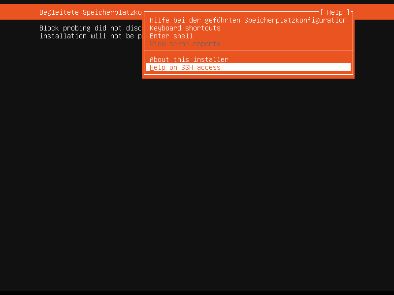
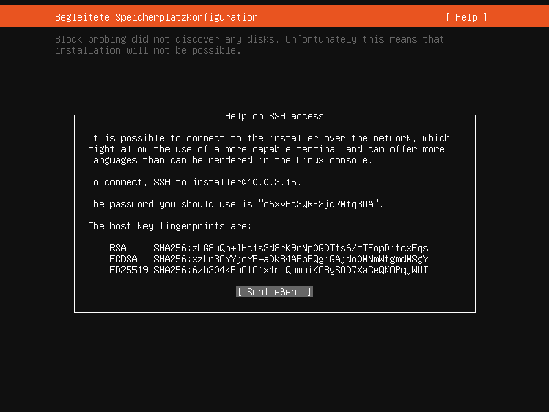
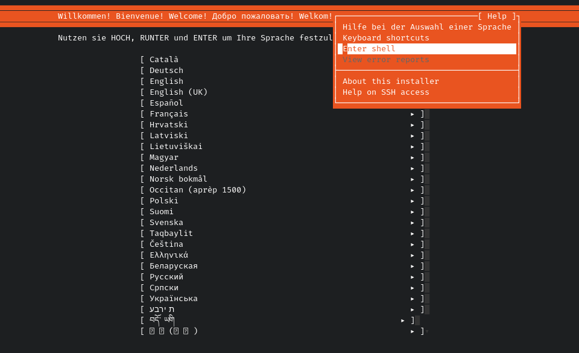
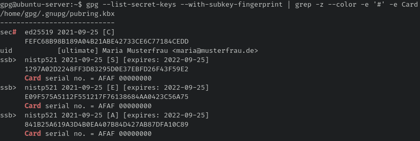

# GnuPG Smartcard

> ️⚠️ You can find information on my GnuPG public key in my [GitHub profile README](https://github.com/duxsco/)! ⚠️

> ⚠ Take a look at the troubleshooting (especially if it comes to GnuPG) at the bottom if you have any problems. ⚠

## Credits

Thanks [Fan Jiang](https://github.com/ProfFan) for: https://blog.amayume.net/diy-smartcard-authentication-with-smartpgp/

## Prepare the system

In the following, I am using the [Ubuntu Live Server ISO](https://releases.ubuntu.com/focal/) as well as the smartcard `J3H145` (recommended [here](https://github.com/ANSSI-FR/SmartPGP/search?q=J3H145&type=issues)). You also need a supported smartcard reader of whom I prefer those including  pinpad and screen. Further info:

- [CCID Driver](https://github.com/LudovicRousseau/CCID#ccid-and-iccd-readers)
- [Arch Linux Wiki](https://wiki.archlinux.org/title/Electronic_identification)
- [Debian Wiki](https://wiki.debian.org/Smartcards)
- [Gentoo Linux Wiki](https://wiki.gentoo.org/wiki/PCSC-Lite#Additional_software)
- ... and whatever your search engine throws out 😉

After booting from the Ubuntu Live Server ISO, setup the keyboard layout and network. `ssh` into the system:





In the SSH session, open a shell:



Create non-root users:

- `gpg` for GnuPG keypair creation and push subkeys to smartcard via `keytocard`
- `tools` for building required tools for smartcard management and flashing

Install the required packages and start services:

```bash
useradd -m -s /bin/bash -G tty gpg && \
useradd -m -s /bin/bash tools && \
chmod g=rw "$(tty)" && \

apt-get update && \
apt-get install ant git maven openjdk-8-jdk rng-tools pcscd python3-pyscard scdaemon && \
rm -rf /var/lib/apt/lists/* && \
systemctl start pcscd && \
systemctl start rng-tools; echo $?
```

Build the required software:

- [SmartPGP](https://github.com/ANSSI-FR/SmartPGP): a free and open source implementation of the [OpenPGP card 3.4 specification](https://gnupg.org/ftp/specs/OpenPGP-smart-card-application-3.4.pdf) in JavaCard
- [GlobalPlatformPro](https://github.com/martinpaljak/GlobalPlatformPro): load and manage applets on compatible JavaCards
- [oracle_javacard_sdks](https://github.com/martinpaljak/oracle_javacard_sdks): Oracle JavaCard Classic SDKs

This creates `GlobalPlatformPro/gp.jar` and `SmartPGP/SmartPGPApplet.cap` among others. As of today (October 14th 2021), the current version of `SmartPGP` is `v1.21-3.0.4` and of `GlobalPlatformPro` is `v20.01.23`. Make sure you use a recent version and select a `JavaCard 3.0.4` flavor of `SmartPGP` and `oracle_javacard_sdks` which is the latest version supported by the smartcard `J3H145`.

Run these commands as `tools` user **⇨** Execute `su --login tools` beforehand:

```bash
# Select a recent release version of SmartPGP with 3.0.4 JavaCard flavor
export SmartPGP_VERSION="v1.21-3.0.4" && \
git clone https://github.com/ANSSI-FR/SmartPGP.git && \
pushd SmartPGP && \
git checkout "${SmartPGP_VERSION}" && \
git submodule add https://github.com/martinpaljak/oracle_javacard_sdks sdks && \
sed -i 's#<javacard>#<javacard jckit=\"./sdks/jc304_kit\">#' build.xml && \
ant && \
popd; echo $?
```

Run these commands as `tools` user **⇨** Execute `su --login tools` beforehand:

```bash
# Select a recent release version of GlobalPlatformPro
export GlobalPlatformPro_VERSION="v20.01.23" && \
git clone https://github.com/martinpaljak/GlobalPlatformPro.git && \
pushd GlobalPlatformPro && \
git checkout "${GlobalPlatformPro_VERSION}" && \
sed -i 's#http://central.maven.org#https://repo1.maven.org#' build.xml && \
export JAVA_HOME=/usr/lib/jvm/java-8-openjdk-amd64 && \
mvn package && \
ant && \
popd; echo $?
```

> ⚠ Now, internet access is not required anymore. You can disconnect your machine if you like. ⚠

> ⚠ Make a backup of the following key! Lock the smartcard for production use! ⚠

Create a key ([source](https://stackoverflow.com/a/34329057)), flash the smartcard (this may take a while) and lock the smartcard with the key. Run these commands as `tools` user **⇨** Execute `su --login tools` beforehand.

```bash
( umask 0077 && dd iflag=fullblock if=/dev/random | hexdump -n 16 -e '4/4 "%08X" 1 "\n"' > /home/tools/.card_secret ) && \
java -jar GlobalPlatformPro/gp.jar --install SmartPGP/SmartPGPApplet.cap --default && \
cat /home/tools/.card_secret | xargs java -jar GlobalPlatformPro/gp.jar --lock; echo $?
```

## Create a GnuPG keypair

> ⚠ This section can be applied, decoupled from the rest of this guide. It asks you to switch to a `gpg` user. This is only relevant if you followed this guide since beginning and booted from an Ubuntu Live-CD where the initial user is `root`. ⚠
>
> ⚠ If you, however, only want to create a keypair without following the rest of this guide on smartcard setup, just make sure to **execute the commands in this section as non-root**. ⚠

I prefer Curve25519 which (like Curve448) is recommended by [Daniel J. Bernstein and Tanja Lange](https://safecurves.cr.yp.to/). Support for Curve25519 and Curve448 has been added with [JavaCard 3.1](https://docs.oracle.com/en/java/javacard/3.1/specnotes/index.html#JCSRN-GUID-48D9D6BF-B4C1-4114-9A61-5452BE82E1D2), but compatible smartcards are missing. Furthermore, Curve448 is only supported by [GnuPG >=2.3.0](https://dev.gnupg.org/source/gnupg/browse/tag%253A%2520gnupg-2.3.0/NEWS;c922a798a341261f1aafaf7c1c0217e4ce3e3acf$32), and key [export](https://dev.gnupg.org/rGa07ae85ec795e338af1bcbe288a3af4f21bb94ce) and [import](https://dev.gnupg.org/rG0d74c3c89663ee9b163742c6c75641c1b6b28f09) is currently not possible or limited.

As only the subkeys, which I use rsa3072 for, are going to be copied to the smartcard, I use ed25519 for the primary key, because smartcard limitations don't matter for the primary for obvious reasons.

If you want to deviate from default algorithms, export before running below big code block. The values in the exported array stand for:

```
export MY_GPG_ALG=("<primary key algo>" "<'sign' subkey algo>" "<'encrypt' subkey algo>" "<'auth' subkey algo>")
```

Run these commands as `gpg` user **⇨** Execute `su --login gpg` beforehand:

- Use `ed25519/cv25519` (recommended for non-smartcard setups; recommended for [YubiKey 5Ci](https://developers.yubico.com/PGP/YubiKey_5.2.3_Enhancements_to_OpenPGP_3.4.html)):

```
export MY_GPG_ALG=("ed25519" "ed25519" "cv25519" "ed25519")
```

- Use `ed448/cv448` (not recommended due to missing support for key [export](https://dev.gnupg.org/rGa07ae85ec795e338af1bcbe288a3af4f21bb94ce) and [import](https://dev.gnupg.org/rG0d74c3c89663ee9b163742c6c75641c1b6b28f09)):

```
export MY_GPG_ALG=("ed448" "ed448" "cv448" "ed448")
```

- Use `rsa4096`, `rsa3072` or `rsa2048` (recommended for old setups):

```
export MY_GPG_ALG=("rsa4096" "rsa4096" "rsa4096" "rsa4096")
# OR
export MY_GPG_ALG=("rsa3072" "rsa3072" "rsa3072" "rsa3072")
# OR
export MY_GPG_ALG=("rsa2048" "rsa2048" "rsa2048" "rsa2048")
```

- For completeness sake:

```
export MY_GPG_ALG=("nistp256/ecdsa" "nistp256/ecdsa" "nistp256" "nistp256/ecdsa")
# OR
export MY_GPG_ALG=("nistp384/ecdsa" "nistp384/ecdsa" "nistp384" "nistp384/ecdsa")
# OR
export MY_GPG_ALG=("nistp521/ecdsa" "nistp521/ecdsa" "nistp521" "nistp521/ecdsa")
# OR
export MY_GPG_ALG=("brainpoolP256r1/ecdsa" "brainpoolP256r1/ecdsa" "brainpoolP256r1" "brainpoolP256r1/ecdsa")
# OR
export MY_GPG_ALG=("brainpoolP384r1/ecdsa" "brainpoolP384r1/ecdsa" "brainpoolP384r1" "brainpoolP384r1/ecdsa")
# OR
export MY_GPG_ALG=("brainpoolP512r1/ecdsa" "brainpoolP512r1/ecdsa" "brainpoolP512r1" "brainpoolP512r1/ecdsa")
# OR
export MY_GPG_ALG=("secp256k1/ecdsa" "secp256k1/ecdsa" "secp256k1" "secp256k1/ecdsa")
```

Run these commands as `gpg` user **⇨** Execute `su --login gpg` beforehand:

```bash
# If you want to deviate from default algorithms,
# make sure to do above export of MY_GPG_ALG in the same session
# as the one you execute below code:
(
    echo "" && \
    read -r -s -p 'Passphrase to set for private key: ' PASSPHRASE && \
    echo "" && \
    read -r -s -p 'Please, repeat the passphrase: ' PASSPHRASE_REPEAT && \
    [ "${PASSPHRASE}" != "${PASSPHRASE_REPEAT}" ] && \
    echo -e "\nPassphrases don't match! Aborting...\n" || (
        echo -e "\n" && \
        read -r -p 'Name and e-mail (e.g. "Max Mustermann <max@mustermann.de>"): ' CONTACT && \
        echo "" && \
        read -r -p 'When do you want your key to expire?
I recommend January 1st of either the next year or the year after, e.g. "2024-01-01".
You can always extend the validity or create new subkeys later on! ' DATE && \
        MY_GPG_HOMEDIR="$( umask 0077 && mktemp -d )" && \
        echo "cert-digest-algo SHA512
default-preference-list AES256 TWOFISH CAMELLIA256 AES192 CAMELLIA192 AES CAMELLIA128 SHA512 SHA384 SHA256 BZIP2 ZLIB ZIP Uncompressed
" > "${MY_GPG_HOMEDIR}/gpg.conf" && \
        echo "${PASSPHRASE}" | gpg --homedir "${MY_GPG_HOMEDIR}" --batch --pinentry-mode loopback --quiet --passphrase-fd 0 \
            --quick-generate-key "${CONTACT}" "${MY_GPG_ALG[0]:-ed25519}" cert "${DATE}" && \
        FINGERPRINT=$(gpg --homedir "${MY_GPG_HOMEDIR}" --list-options show-only-fpr-mbox --list-secret-keys 2>/dev/null | awk '{print $1}') && \
        echo "${PASSPHRASE}" | gpg --homedir "${MY_GPG_HOMEDIR}" --batch --pinentry-mode loopback --quiet --passphrase-fd 0 \
            --quick-add-key "${FINGERPRINT}" "${MY_GPG_ALG[1]:-rsa3072}" sign "${DATE}" && \
        echo "${PASSPHRASE}" | gpg --homedir "${MY_GPG_HOMEDIR}" --batch --pinentry-mode loopback --quiet --passphrase-fd 0 \
            --quick-add-key "${FINGERPRINT}" "${MY_GPG_ALG[2]:-rsa3072}" encrypt "${DATE}" && \
        echo "${PASSPHRASE}" | gpg --homedir "${MY_GPG_HOMEDIR}" --batch --pinentry-mode loopback --quiet --passphrase-fd 0 \
            --quick-add-key "${FINGERPRINT}" "${MY_GPG_ALG[3]:-rsa3072}" auth "${DATE}" && \
        echo -e '\nSuccess! You can find the GnuPG homedir containing your keypair at \e[0;1;97;104m"'"${MY_GPG_HOMEDIR}"'".\e[0m\nPlease, \e[1;32mbackup that directory\e[0m somewhere safe!\n\nExport/import of Curve448 keys is currently unsupported:\n - https://dev.gnupg.org/rGa07ae85ec795e338af1bcbe288a3af4f21bb94ce\n - https://dev.gnupg.org/rG0d74c3c89663ee9b163742c6c75641c1b6b28f09\n' && \
        gpgconf --homedir "${MY_GPG_HOMEDIR}" --kill all && \
        rm -f "${MY_GPG_HOMEDIR}/gpg.conf"
    )
)
```

Sample run:

```
Passphrase to set for private key:
Please, repeat the passphrase:

Name and e-mail (e.g. "Max Mustermann <max@mustermann.de>"): Maria Musterfrau <maria@musterfrau.de>

When do you want your key to expire?
I recommended January 1st of either the next year or the year after, e.g. "2024-01-01".
You can always extend the validity or create new subkeys later on! 2024-01-01

Success! You can find the GnuPG homedir containing your keypair at "/tmp/tmp.MRXuClxx99".
Please, backup that directory somewhere safe!

Export/import of Curve448 keys is currently unsupported:
 - https://dev.gnupg.org/rGa07ae85ec795e338af1bcbe288a3af4f21bb94ce
 - https://dev.gnupg.org/rG0d74c3c89663ee9b163742c6c75641c1b6b28f09

❯ gpg --homedir /tmp/tmp.MRXuClxx99 --list-secret-keys
/tmp/tmp.MRXuClxx99/pubring.kbx
-------------------------------
sec   ed25519 2022-11-18 [C] [expires: 2024-01-01]
      839C383BDC49BD54948F93617ACF1D096561F913
uid           [ultimate] Maria Musterfrau <maria@musterfrau.de>
ssb   rsa3072 2022-11-18 [S] [expires: 2024-01-01]
ssb   rsa3072 2022-11-18 [E] [expires: 2024-01-01]
ssb   rsa3072 2022-11-18 [A] [expires: 2024-01-01]
```

In addition to the recommended folder backup, you can easily backup the keypair given that no Curve448 key has been created:

```
❯ gpg --homedir /tmp/tmp.MRXuClxx99 --armor --export-secret-keys > ~/secret_keys.asc
❯ gpg --homedir /tmp/tmp.MRXuClxx99 --export-ownertrust > ~/ownertrust.txt
```

I strongly recommend testing the restore:

```
❯ export GNUPGHOME="$(mktemp -d)"
❯ gpg --import ~/secret_keys.asc
❯ gpg --import-ownertrust ~/ownertrust.txt
❯ gpg --list-secret-keys
/tmp/tmp.KTbwDxW9Om/pubring.kbx
-------------------------------
sec   ed25519 2022-11-18 [C] [expires: 2024-01-01]
      839C383BDC49BD54948F93617ACF1D096561F913
uid           [ultimate] Maria Musterfrau <maria@musterfrau.de>
ssb   rsa3072 2022-11-18 [S] [expires: 2024-01-01]
ssb   rsa3072 2022-11-18 [E] [expires: 2024-01-01]
ssb   rsa3072 2022-11-18 [A] [expires: 2024-01-01]
❯ unset GNUPGHOME
```

## Copy GnuPG subkeys to smartcard

> ⚠ First of all, make a backup of the GnuPG homedir! If you save after a `keytocard` command, the subkey - copied to the smartcard - will be removed by GnuPG locally and exists only on the smartcard! You won't be able to copy said subkey to another smartcard! ⚠

### Switch to rsa3072 subkeys

By default, `rsa2048` is used for all subkeys:

```bash
su --login gpg -c "gpg --card-status | grep 'Key attributes'"
```

To switch over to `rsa3072`, GnuPG cannot be used. You have to use SmartPGP:

```bash
su --login tools -c "/home/tools/SmartPGP/bin/smartpgp-cli switch-rsa3072"
```

### Set smartcard pin and admin pin

Run these commands as `gpg` user **⇨** Execute `su --login gpg` beforehand:

```bash
gpg --card-edit

# Enable "admin" commands
gpg/card> admin

# Switch to "passwd" mode
gpg/card> passwd

# Select "3 - change Admin PIN" and set a new 8-digit admin pin.
# The initial admin pin is "12345678".
# First, you need to type in the initial admin pin and press "Enter".
# Then, you have to type in your new admin pin and press "Enter".
# Type in your new admin pin again and confirm again.

# Select "1 - change PIN" and set a new 6-digit pin.
# The procedure is the same as for the admin pin,
# but the initial pin is "123456".

# Quit and exit
```

### Set name (optional)

Run these commands as `gpg` user **⇨** Execute `su --login gpg` beforehand:

```bash
gpg --card-edit

# Enable "admin" commands
gpg/card> admin

# Execute "name" command and type in your name thereafter
# You will be prompted for the admin pin
gpg/card> name
```

### Set keyserver (optional)

Run these commands as `gpg` user **⇨** Execute `su --login gpg` beforehand:

```bash
gpg --card-edit

# Enable "admin" commands
gpg/card> admin

# Execute "url" command and type in your keyserver, hkps://keys.openpgp.org recommended
gpg/card> url
```

### Copy subkeys to smartcard

> ⚠ First of all, make a backup of the GnuPG homedir! If you save after a `keytocard` command, the subkey - copied to the smartcard - will be removed by GnuPG locally and exists only on the smartcard! You won't be able to copy said subkey to another smartcard! ⚠

Run these commands as `gpg` user **⇨** Execute `su --login gpg` beforehand:

```bash
❯ gpg --list-secret-keys
/tmp/tmp.MRXuClxx99/pubring.kbx
-------------------------------
sec   ed25519 2022-11-18 [C] [expires: 2024-01-01]
      839C383BDC49BD54948F93617ACF1D096561F913
uid           [ultimate] Maria Musterfrau <maria@musterfrau.de>
ssb   rsa3072 2022-11-18 [S] [expires: 2024-01-01]
ssb   rsa3072 2022-11-18 [E] [expires: 2024-01-01]
ssb   rsa3072 2022-11-18 [A] [expires: 2024-01-01]

❯ gpg --edit-key 839C383BDC49BD54948F93617ACF1D096561F913
gpg (GnuPG) 2.2.19; Copyright (C) 2019 Free Software Foundation, Inc.
This is free software: you are free to change and redistribute it.
There is NO WARRANTY, to the extent permitted by law.

Secret key is available.

sec  ed25519/7ACF1D096561F913
     created: 2022-11-18  expires: 2024-01-01  usage: C # certify
     trust: ultimate      validity: ultimate
ssb  rsa3072/E42BBA11B2C61A52
     created: 2022-11-18  expires: 2024-01-01  usage: S # sign
ssb  rsa3072/406011C3623AFECC
     created: 2022-11-18  expires: 2024-01-01  usage: E # encrypt
ssb  rsa3072/B419336565A70C54
     created: 2022-11-18  expires: 2024-01-01  usage: A # authenticate
[ultimate] (1). Maria Musterfrau <maria@musterfrau.de>

gpg> key 1

sec  ed25519/7ACF1D096561F913
     created: 2022-11-18  expires: 2024-01-01  usage: C
     trust: ultimate      validity: ultimate
ssb* rsa3072/E42BBA11B2C61A52                           # subkey 1 selected (*)
     created: 2022-11-18  expires: 2024-01-01  usage: S
ssb  rsa3072/406011C3623AFECC
     created: 2022-11-18  expires: 2024-01-01  usage: E
ssb  rsa3072/B419336565A70C54
     created: 2022-11-18  expires: 2024-01-01  usage: A
[ultimate] (1). Maria Musterfrau <maria@musterfrau.de>

gpg> keytocard
Please select where to store the key:
   (1) Signature key
   (3) Authentication key
Your selection? 1

sec  ed25519/7ACF1D096561F913
     created: 2022-11-18  expires: 2024-01-01  usage: C
     trust: ultimate      validity: ultimate
ssb* rsa3072/E42BBA11B2C61A52
     created: 2022-11-18  expires: 2024-01-01  usage: S
ssb  rsa3072/406011C3623AFECC
     created: 2022-11-18  expires: 2024-01-01  usage: E
ssb  rsa3072/B419336565A70C54
     created: 2022-11-18  expires: 2024-01-01  usage: A
[ultimate] (1). Maria Musterfrau <maria@musterfrau.de>

gpg> key 1                                               # deselect subkey 1

sec  ed25519/7ACF1D096561F913
     created: 2022-11-18  expires: 2024-01-01  usage: C
     trust: ultimate      validity: ultimate
ssb  rsa3072/E42BBA11B2C61A52
     created: 2022-11-18  expires: 2024-01-01  usage: S
ssb  rsa3072/406011C3623AFECC
     created: 2022-11-18  expires: 2024-01-01  usage: E
ssb  rsa3072/B419336565A70C54
     created: 2022-11-18  expires: 2024-01-01  usage: A
[ultimate] (1). Maria Musterfrau <maria@musterfrau.de>

gpg> key 2

sec  ed25519/7ACF1D096561F913
     created: 2022-11-18  expires: 2024-01-01  usage: C
     trust: ultimate      validity: ultimate
ssb  rsa3072/E42BBA11B2C61A52
     created: 2022-11-18  expires: 2024-01-01  usage: S
ssb* rsa3072/406011C3623AFECC                           # subkey 2 selected
     created: 2022-11-18  expires: 2024-01-01  usage: E
ssb  rsa3072/B419336565A70C54
     created: 2022-11-18  expires: 2024-01-01  usage: A
[ultimate] (1). Maria Musterfrau <maria@musterfrau.de>

gpg> keytocard
Please select where to store the key:
   (2) Encryption key
Your selection? 2

sec  ed25519/7ACF1D096561F913
     created: 2022-11-18  expires: 2024-01-01  usage: C
     trust: ultimate      validity: ultimate
ssb  rsa3072/E42BBA11B2C61A52
     created: 2022-11-18  expires: 2024-01-01  usage: S
ssb* rsa3072/406011C3623AFECC
     created: 2022-11-18  expires: 2024-01-01  usage: E
ssb  rsa3072/B419336565A70C54
     created: 2022-11-18  expires: 2024-01-01  usage: A
[ultimate] (1). Maria Musterfrau <maria@musterfrau.de>

gpg> key 2                                               # deselect subkey 2

sec  ed25519/7ACF1D096561F913
     created: 2022-11-18  expires: 2024-01-01  usage: C
     trust: ultimate      validity: ultimate
ssb  rsa3072/E42BBA11B2C61A52
     created: 2022-11-18  expires: 2024-01-01  usage: S
ssb  rsa3072/406011C3623AFECC
     created: 2022-11-18  expires: 2024-01-01  usage: E
ssb  rsa3072/B419336565A70C54
     created: 2022-11-18  expires: 2024-01-01  usage: A
[ultimate] (1). Maria Musterfrau <maria@musterfrau.de>

gpg> key 3

sec  ed25519/7ACF1D096561F913
     created: 2022-11-18  expires: 2024-01-01  usage: C
     trust: ultimate      validity: ultimate
ssb  rsa3072/E42BBA11B2C61A52
     created: 2022-11-18  expires: 2024-01-01  usage: S
ssb  rsa3072/406011C3623AFECC
     created: 2022-11-18  expires: 2024-01-01  usage: E
ssb* rsa3072/B419336565A70C54                           # subkey 3 selected
     created: 2022-11-18  expires: 2024-01-01  usage: A
[ultimate] (1). Maria Musterfrau <maria@musterfrau.de>

gpg> keytocard
Please select where to store the key:
   (3) Authentication key
Your selection? 3

sec  ed25519/7ACF1D096561F913
     created: 2022-11-18  expires: 2024-01-01  usage: C
     trust: ultimate      validity: ultimate
ssb  rsa3072/E42BBA11B2C61A52
     created: 2022-11-18  expires: 2024-01-01  usage: S
ssb  rsa3072/406011C3623AFECC
     created: 2022-11-18  expires: 2024-01-01  usage: E
ssb* rsa3072/B419336565A70C54
     created: 2022-11-18  expires: 2024-01-01  usage: A
[ultimate] (1). Maria Musterfrau <maria@musterfrau.de>

gpg> quit
Save changes? (y/N) n                                    # saving leads to deletion of subkeys on the local filesystem
Quit without saving? (y/N) y
```

### Copy required info from air gapped machine to working machine

In order to be able to fully use your smartcard, you need to copy the public keys as well as ownertrust to all machines you want to use your smartcard with.

Create backup of public keys and ownertrust:

```bash
su --login gpg
gpg --armor --export > pubkey.asc
gpg --export-ownertrust > ownertrust.txt
```

On your working machine, import:

```bash
gpg --import pubkey.asc
gpg --import-ownertrust ownertrust.txt
```

Execute on your working machine `gpg --card-status` to make it aware of the private keys on the smartcard. If everything went well you should see that the subkeys are located on the card. A `#` after the initial tags `sec` or `ssb` means that the primary key or subkey is currently not usable (offline) which is what we wish for in case of the primary key. The primary key is only used for the creation of subkeys and is only needed on your air gapped machine.



## Troubleshooting

> ⚠ First of all, make sure that the smartcard is unlocked! Otherwise, you may brick your smartcard! ⚠

```bash
cat .card_secret | xargs java -jar GlobalPlatformPro/gp.jar --unlock --key
```

### Show info

Show info on **unlocked** smartcard:

```bash
java -jar GlobalPlatformPro/gp.jar --info
```

List applets on **unlocked** smartcard:

```bash
java -jar GlobalPlatformPro/gp.jar --list
```

### Delete applet

Delete **default** applet on **unlocked** smartcard:

```bash
java -jar GlobalPlatformPro/gp.jar --delete --default
```

Delete certain applet on **unlocked** smartcard:

  1. First copy `From:` value of `APP` in applet list output
  2. Execute while providing said value:

```bash
java -jar GlobalPlatformPro/gp.jar --delete ASDFASDFASDF
```

### GnuPG failing

If GnuPG is causing problems set permissions again (as root):

```bash
chmod g=rw "$(tty)"
```

## Other GnuPG repos

https://github.com/duxsco?tab=repositories&q=gpg-
